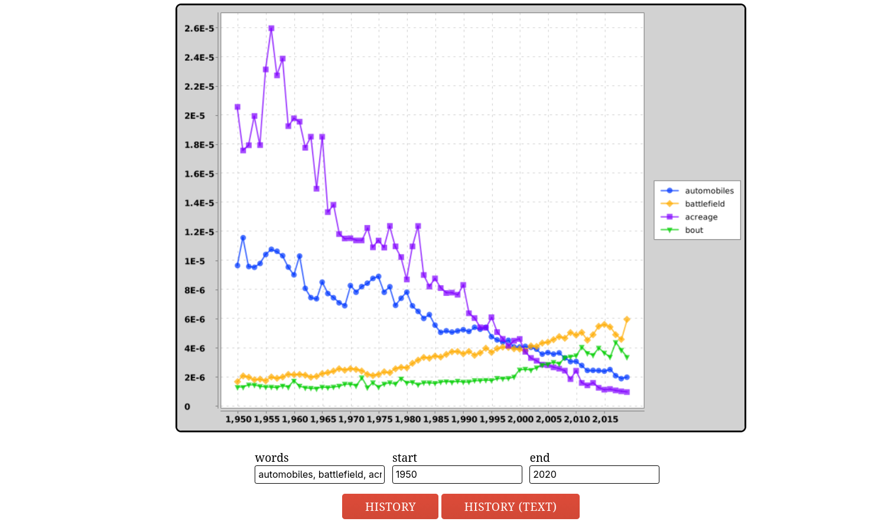
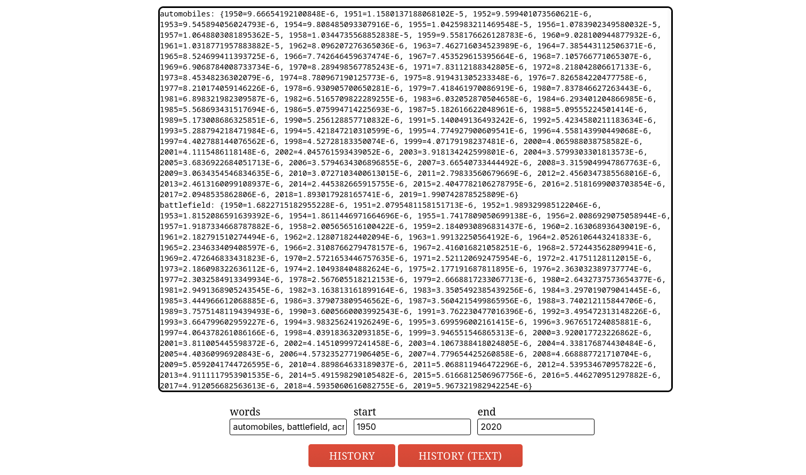
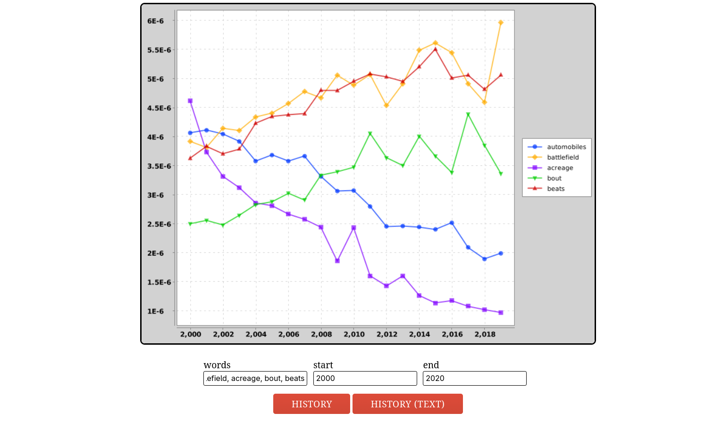
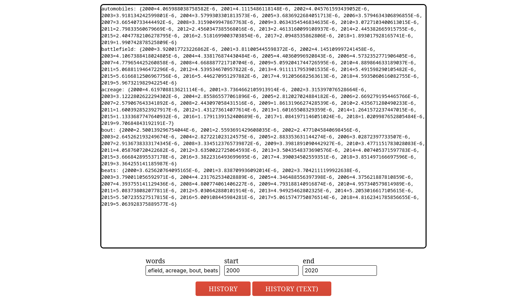

# 📉 NGram Explorer

A high-performance Java engine for visualizing linguistic trends using Google's million-volume NGram dataset. This application allows users to query word frequencies over centuries, generating both interactive visual charts and raw statistical data.

## 🚀 Key Engineering Highlights
* **Custom TimeSeries Data Structure**: Extends `TreeMap<Integer, Double>` to provide $O(\log n)$ lookup and insertion for year-based data, optimized for chronological analysis.
* **Full-Stack Java Integration**: Features a backend built with the **Spark Java** framework and **Gson** for seamless data transmission between the Java engine and the JavaScript frontend.
* **Linguistic Analysis API**: Implements complex data processing algorithms including **Summed Weight History** and **Relative Frequency** calculations.
* **Modern Build System**: Fully migrated to **Maven** for automated dependency management and standardized project lifecycle.

## 🛠️ Development Journey & Refactoring
This project originally began as a challenge within the **UC Berkeley CS 61B** curriculum to practice complex data structures. However, I performed an extensive **"Professional Refactor"** to turn it into a standalone production-ready application:
* **Dependency Decoupling**: Removed all university-specific libraries (like `algs4.jar`) and replaced them with standard Java `Scanner` and `File` I/O logic.
* **Architecture Migration**: Transitioned from a manual IntelliJ project structure to a standard **Maven** layout, ensuring environment reproducibility.
* **Robust Error Handling**: Implemented explicit `try-catch` blocks for data loading to handle missing files and malformed entries gracefully.

## 🧪 Testing & Verification
The engine is backed by a comprehensive **JUnit 5** test suite located in `src/test/java/`:
* **Unit Tests**: Verifies core `TimeSeries` math (e.g., `plus`, `dividedBy`) to ensure 100% accuracy in frequency calculations.
* **Integration Tests**: Confirms the `NGramMap` correctly parses both tab-separated and comma-separated datasets.
* **Edge Case Handling**: Tests behavior for years outside the 1400–2100 range and words missing from the dataset.

## 📊 Data Acquisition
This project processes data from the [Google Books NGram Dataset](https://drive.google.com/file/d/1xGTZqCo5maiZjA307OPocmKDOTYlJXnz/view). 
* **Words File**: A tab-separated file containing words, years, and occurrences.
* **Counts File**: A comma-separated file tracking the total words recorded globally per year.
* **Included Data**: A sample set (`very_short.csv`) is included in the `data/` folder for immediate local testing.

> **Note on Data:** Due to GitHub's file size limits, the full 100MB+ Google NGram datasets are not included in this repository. 
> To run the full analysis:
> 1. Download the datasets from [Google Books NGram](https://drive.google.com/file/d/1xGTZqCo5maiZjA307OPocmKDOTYlJXnz/view).
> 2. Place them in the `data/ngrams/` directory.
> 3. Update the file paths in `utils/Utils.java`.

## 📸 Visualizing Trends
| History Chart | Textual Telemetry |
| :---: | :---: |
|  |  |
|  |  |

## 🚦 Getting Started
1. **Clone**: `git clone https://github.com/nikolozue93/ngram-explorer.git`
2. **Sync**: Open in IntelliJ; Maven will download **Spark**, **XChart**, and **Gson** automatically.
3. **Run**: Execute `Main.java` and visit `http://localhost:4567/ngordnet_2a.html`.